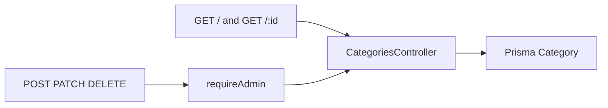

# Categories

`src/routes/categories.js` → `src/services/categories.controller.js`. Schema: `src/validation/categories.schema.js`.

```mermaid
flowchart LR
  read[GET / and GET /:id]
  write[POST PATCH DELETE]
  read --> controller[CategoriesController]
  write --> admin[requireAdmin]
  admin --> controller
  controller --> prisma[Prisma Category]
```

Public reads. Only an admin creates, edits, or deletes.
