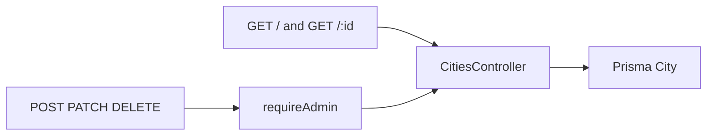

# Cities

`src/routes/cities.js` → `src/services/cities.controller.js`. Schema: `src/validation/cities.schema.js`.

```mermaid
flowchart LR
  read[GET / and GET /:id]
  write[POST PATCH DELETE]
  read --> controller[CitiesController]
  write --> admin[requireAdmin]
  admin --> controller
  controller --> prisma[Prisma City]
```

Jobs, companies, and services optionally point at `cityId`.
