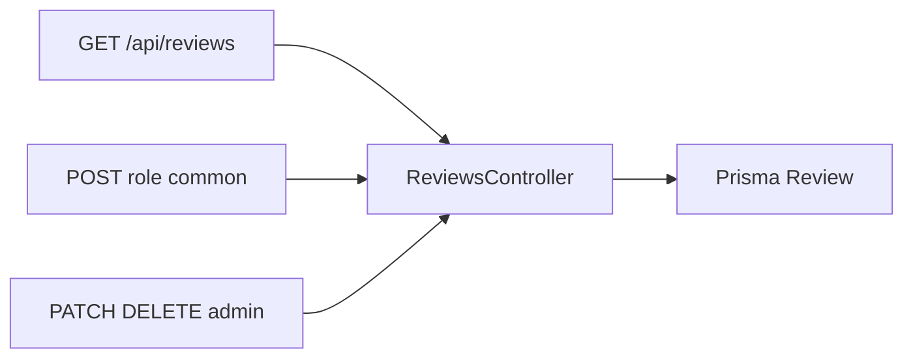

# Reviews

`src/routes/reviews.js` → `src/services/reviews.controller.js`. Job-scoped reviews also live on `POST /api/jobs/:slug/reviews`. Schema: `src/validation/reviews.schema.js`.

```mermaid
flowchart LR
  list[GET /api/reviews]
  create[POST role common]
  moderate[PATCH DELETE admin]
  list --> controller[ReviewsController]
  create --> controller
  moderate --> controller
  controller --> prisma[Prisma Review]
```
