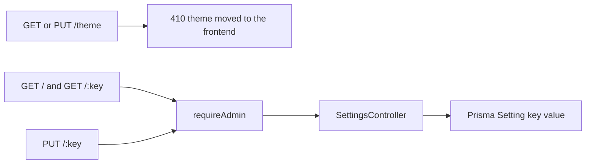

# Settings

`src/routes/settings.js` → `src/services/settings.controller.js`. Schema: `src/validation/settings.schema.js`.

```mermaid
flowchart LR
  theme[GET or PUT /theme]
  list[GET / and GET /:key]
  upsert[PUT /:key]
  theme --> gone[410 theme moved to the frontend]
  list --> admin[requireAdmin]
  upsert --> admin
  admin --> controller[SettingsController]
  controller --> prisma[Prisma Setting key value]
```

Theme is stored in the Next.js UI, not here.
